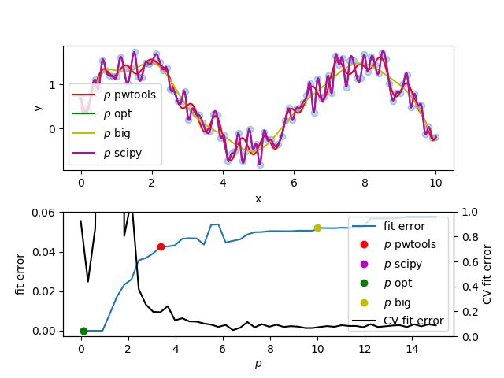
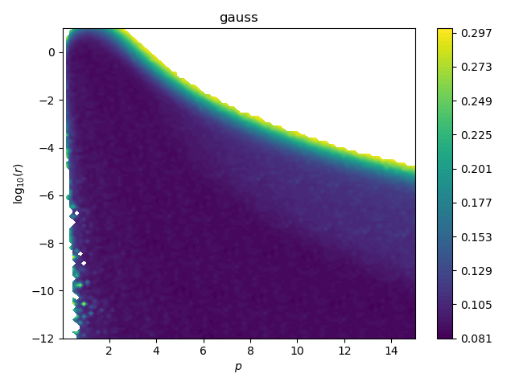

.. include:: ../refs.rst

.. _rbf:

Radial Basis Function Networks for interpolation or fitting of N-dim data
=========================================================================

Some background information on the method implemented in :mod:`~pwtools.rbf`.
For code examples, see the doc string of :class:`~pwtools.rbf.Rbf`.

Theory
------

The goal is to interpolate or fit an unordered set of :math:`M` ND data points
:math:`\mathbf x_i` and values :math:`z_i` so as to obtain :math:`z=f(\mathbf
x)`. In radial basis function (RBF) interpolation, the interpolating function
:math:`f(\mathbf x)` is a linear combination of RBFs :math:`\phi(r)`

.. math::
    f(\mathbf x) = \sum_j w_j\,\phi(|\mathbf x - \mathbf c_j|)

with the weights :math:`w_j` and the center points :math:`\mathbf c_j`.
The function :math:`f(\mathbf x)` can be also thought of as a neural
network with one hidden layer and activation functions :math:`\phi`, which is a
`function approximator <wiki_rbf_>`_.

An RBF :math:`\phi(r)` is a function of the distance :math:`r=|\mathbf x -
\mathbf c_j|` between :math:`\mathbf x` and a center point. Common functions
include

.. math::
    \begin{align}
        & \phi(r) = \exp\left(-\frac{r^2}{2\,p^2}\right) && \text{Gaussian}\\
        & \phi(r) = \sqrt{r^2 + p^2} && \text{multiquadric}\\
        & \phi(r) = \frac{1}{\sqrt{r^2 + p^2}} && \text{inverse multiquadric}
    \end{align}

All RBFs contain a single parameter :math:`p` which defines the width of the
function.

.. image:: ../../_static/rbfs.png

In interpolation the center points :math:`\mathbf c_j` are equal to the data points
:math:`\mathbf x_j` such that

.. math::
    \begin{gather}
        z_i = f(\mathbf x_i) = \sum_j w_j\,\phi(|\mathbf x_i - \mathbf x_j|) = \sum_j w_j\,G_{ij}\\
        \mathbf G\,\mathbf w = \mathbf z\\
    \end{gather}

with :math:`\mathbf G` the :math:`M\times M` matrix of RBF function values. The
weights :math:`\mathbf w = (w_j)` are found by solving the linear system
:math:`\mathbf G\,\mathbf w = \mathbf z`.

Thus, the applicability of the method is limited by the number of points
:math:`M` in the sense that a dense linear system :math:`M\times M` must be
stored and solved. For large point sets, the calculation of the distance matrix
:math:`R_{ij} = |\mathbf x_i - \mathbf x_j|` is one of the bottlenecks. In
pwtools, this is coded in Fortran (see :func:`~pwtools.num.distsq`).

RBF parameter :math:`p`
-----------------------
Each RBF has a single "width" parameter :math:`p`, which can be tuned
(attribute ``Rbf.p`` in the code). While :math:`f(\mathbf x)` goes through all
data points (:math:`\mathbf x_i`, :math:`z_i`) by definition in interpolation,
the behavior of the interpolation between points is determined by :math:`p`.
For instance, too narrow functions :math:`\phi` can lead to oscillations
between points. Therefore :math:`p` must be tuned for the specific data set.
The scipy implementation :math:`p_{\text{scipy}}` in
:class:`scipy.interpolate.Rbf` uses something like the mean nearest neighbor
distance. We provide this as ``Rbf(points, values, p='scipy')`` or
``rbf.estimate_p(points, 'scipy')``. The default in :class:`pwtools.rbf.Rbf`
however is the mean distance of all points

.. math::
   p_{\text{pwtools}}=1/M^2\,\sum_{ij} R_{ij}

Use ``Rbf(points, values, p='mean')`` or ``rbf.estimate_p(points, 'mean')``. This
is always bigger than :math:`p_{\text{scipy}}`, and yes this will change with
the min-max span of the data, while the mean nearest neighbor distance stays
constant. However it is usually the better start guess for :math:`p`,
especially in case of `fitting` instead of `interpolation` since it is less
prone to overfitting in case of noisy data, where the smaller scipy :math:`p`
will often still interpolate all points. See below for more on this.

Interpolation vs. fitting, regularization and numerical stability
-----------------------------------------------------------------

For smooth noise-free data, RBF provides nice interpolation. But for noisy
data, we do not want interpolation. Interpolating noisy data (:math:`f(\mathbf
x)` goes though all points :math:`(\mathbf x_i, z_i)` exactly) is the limit
case of what is called overfitting in ML. In this case, we would like to do a
fit instead, similar to the `s` parameter of :func:`scipy.interpolate.bisplrep`
or the `smooth` parameter for regularization in :class:`scipy.interpolate.Rbf`
. Here we can do the same and solve a regularized version of the linear system

.. math::
        (\mathbf G + r\,\mathbf I)\,\mathbf w = \mathbf z

using, for instance, ``Rbf(points, values, r=1e-8)`` (attribute ``Rbf.r``).
This creates a more "stiff" (low curvature) function :math:`f(\mathbf x)` which
does not necessarily interpolate all points. When turning interpolation into
fitting by regularization, the method is also often termed Kernel Ridge
Regression (KRR).

Apart from smoothing, the regularization also deals with another problem: the
numerical instability of :math:`\mathbf G\,\mathbf w = \mathbf z`, which
results in :func:`scipy.linalg.solve` returning bogus if :math:`\mathbf G` is
ill-conditioned.

One can also switch from :func:`scipy.linalg.solve` to
:func:`scipy.linalg.lstsq` and solve the system in a least squares sense
without regularization. In that case we also get much more stable solutions.
The advantage [*] of using least squares is that we have the smoothness by
construction no smoothness parameter :math:`r` needs to be tuned. If the noise
is low relative to the point distance, we get interpolation-like results, which
cannot be distinguished from the solutions obtained with a normal linear system
solver. The method will try its best to do interpolation, but will smoothly
transition to fitting as noise increases.

[*] However, we found that ``lstsq`` can introduce small numerical noise in the
    solution, so test before using (as always!).

How to determine :math:`p` and :math:`r`
----------------------------------------

:math:`p` and :math:`r` can be determined by minimization of an unbiased fit
error metric such as K-fold cross validation (CV). This partitions the data
:math:`K` times into test and training (fit) data and fits this using the same
parameters :math:`p` and :math:`r`. The fit error metric is the sum (or median
or ...) of the :math:`K` errors of individual fits, which is minimal when the
parameters generate smooth approximations of the data that neither overfit
(worst case: interpolation) nor result in overly stiff functions that don't
follow the data at all, also called "good generalization" in ML speak.

The above is valid for fitting. For interpolation (:math:`r=0`) only :math:`p`
must be tuned. One can use a special variant of CV, namely leave-one-out (also
suggested in `Numerical Recipes 3rd. ed, ch. 3.7 <nr3_>`_, but not under that
name). The rationale is that the interpolation function needs support from as
much points as possible , such that keeping points around one singe left-out
point provides the best interpolation error measure at that point.

We start by tuning only :math:`p` in a fitting setup, with :math:`r` constant
and very small such as ``1e-11`` or ``r=None`` (least squares solver). See
``examples/rbf/overfit.py``, where we use :class:`~pwtools.rbf.FitError` and
:class:`sklearn.model_selection.RepeatedKFold`.

There is a global minimum :math:`p_{\text{opt}}` of zero fit error at very
small :math:`p` (narrow RBFs can fit all points -> interpolation), which is
almost exactly :math:`p_{\text{scipy}}`. That value is good for interpolation,
but not for fitting. Observe how the CV fit error and normal fit error show
opposite trends with increasing :math:`p`. We find that for this example data
set, all values :math:`p>6` produce low CV fit errors and can be used. This
example shows that it is paramount to use cross-validation to calculate a more
useful fit error metric.

Now we want to determine :math:`r` in addition to :math:`p`, using the same test
data (noisy sine, see ``examples/rbf/crossval_map_p_r.py``). For that, we
calculate and plot the CV fit error on a 12 x 12 (:math:`p`, :math:`r`)
grid. This is the result for the Gaussian RBF.

We find that in regions of high :math:`r` (strong regularization = strong
smoothing) where :math:`r` is around 0.1 (:math:`\log_{10}(r)=-1`), we can
apply rather low :math:`p` (narrow RBFs which
can overfit) since :math:`r` provides enough stiffness to prevent overfitting.
In regions of typical low :math:`r` (``1e-6`` and lower), it basically doesn't
matter which :math:`p` we use, as long as it is big enough to not overfit. In
these regions, both :math:`p` and :math:`r` provide stiffness.
The large :math:`p`-:math:`r` valley of low CV fit error is flat and a bit rugged
such that there is no pronounced global optimum. Thus there is no use for
optimization. One simply needs to know the error landscape.

Data scaling
------------
(a) RBFs are symmetric in all dimensions (length of :math:`\mathbf x`) of points
space. (b) For typical :math:`p` values (e.g. Gaussian RBF with :math:`p=1`) all
:math:`z` values have the same order of magnitude as :math:`\mathbf
x`-values where :math:`z\gg 0`.
Thus, it usually helps to scale the input data (points :math:`\mathbf x_i` and
values :math:`z_i`) to a similarly equal order of magnitude, e.g. all have a
maximum close to unity or so. We do this in :class:`~pwtools.num.PolyFit` (see
the `scale` keyword). Here, we haven't implemented this yet, so you need to do that
manually.

Other implementations
---------------------

* :class:`scipy.interpolate.Rbf`
* http://pypi.python.org/pypi/PyRadbas/0.1.0
* http://code.google.com/p/pyrbf/

