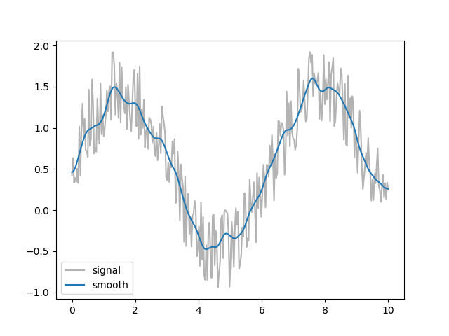

Tutorial
========

Here we collect random short code snippets showing how to perform various
common tasks.

Using ASE?
----------
No problem, use :func:`~pwtools.crys.atoms2struct` and
:func:`~pwtools.crys.struct2atoms` to convert back and forth. If you have a
:class:`~pwtools.crys.Structure`, you can also use the
:meth:`~pwtools.crys.Structure.get_ase_atoms` method, which is the same as
``struct2atoms(struct)``.

For basic ASE compatibility, you may get away with
:meth:`~pwtools.crys.Structure.get_fake_ase_atoms`. That creates an object
which behaves like ``ase.Atoms`` without the need to have ASE installed.
This is used in :mod:`pwtools.symmetry`, for example.

Parse MD output, plot stuff
---------------------------
Lets take cp2k as an example (assuming an interactive Ipython session)::

    >>> from pwtools import io
    >>> tr = io.read_cp2k_md('cp2k.out')
    >>> plot(tr.etot)
    >>> figure()
    >>> # x-coord of all atoms over time
    >>> plot(tr.coords[...,0])

Parse SCF or relax output, plot stuff
-------------------------------------
Parse SCF and relax run from PWscf::

    >>> from pwtools import io
    >>> st = io.read_pw_scf('pw.scf.out')
    >>> # coords, forces, ...: shape = (natoms,3)
    >>> print st.coords, st.etot
    >>> tr = io.read_pw_md('pw.relax.out')
    >>> plot(tr.etot)
    >>> figure()
    >>> # max force component during relaxation
    >>> # tr.forces.shape = (nstep, natoms, 3)
    >>> plot(np.max(np.abs(tr.forces), axis=0))

Binary IO
---------
You can save a :class:`~pwtools.crys.Structure` or
:class:`~pwtools.crys.Trajectory` object as binary file::

    >>> # save to binary pickle file
    >>> tr.dump('traj.pk')

and read it back in later using :func:`~pwtools.io.read_pickle` ::

    >>> tr = io.read_pickle('traj.pk')

which is usually very fast.

View a structure or trajectory
------------------------------

Supported viewers are xcrysden_, jmol_, avogadro_ and VMD_. Look at single
structs or trajectories.

::

    >>> from pwtools import visualize, random
    >>> st = random.random_struct(['Si']*50)
    >>> visualize.view_xcrysden(st)
    >>> ##visualize.view_jmol(st)    
    >>> ##visualize.view_avogadro(st)    

.. image:: ../_static/random_Si.png

Andf you have VMD installed, view a random MD trajectory::

    >>> import os
    >>> from pwtools import crys
    >>> tr = crys.concatenate([random.random_struct(['Si']*10) for i in \
    ...                        range(5)])
    >>> # vmd startup script
    >>> vmd_script = os.path.dirname(visualize.__file__) + \
                                     '/examples/vmd/nice_bonds.tcl'

    >>> visualize.view_vmd_axsf(tr, options='-e %s' %vmd_script)

Find Monkhorst-Pack k-grid sampling for a given unit cell
---------------------------------------------------------

Say you know from a previous convergence study that a k-grid spacing of
``h=0.5`` 1/Angstrom is OK. Now you have a slab or other super cell of your
structure and you want to know "what k-grid do I need to get the same
accuracy". Simple::

    >>> from pwtools import crys
    >>> # new cell in Angstrom
    >>> cell=np.diag([8,8,5])
    >>> crys.kgrid(cell, h=0.5)
    array([2, 2, 3])

OK, so use a :math:`2\times2\times3` MP grid. Instead of defining ``cell`` by
hand, you could also build your structure, have it in a Structure object, say
``st`` and use ``st.cell`` instead.

Find spacegroup
---------------
Say you have a Trajectory ``tr``, which is the result of a relax calculation and you
want to know the space group of the final optimized structure, namely
``tr[-1]``::

    >>> from pwtools import symmetry, crys
    >>> symmetry.get_spglib_spacegroup(tr[-1], symprec=1e-2)

Easy, eh? Or build one using ASE::

    >>> import ase.build
    >>> at = ase.build.bulk(name='AlN', crystalstructure='rocksalt', a=3)
    >>> symmetry.spglib_get_spacegroup(crys.atoms2struct(at))
    (225, 'Fm-3m')
    

Smoothing a signal or a Trajectory
----------------------------------
Smoothing a signal (usually called "time series") can be done by convolution
with another function (e.g. with ``scipy.signal.convolve`` or
``scipy.signal.fftconvolve``). We implement advanced methods which add edge
effect handling: :func:`pwtools.signal.smooth`. The same can be applied to a
Trajectory, which is just a "time series" of Structures. See
:func:`pwtools.crys.smooth`::

    >>> a = rand(10000)
    >>> a_smooth = signal.smooth(a, scipy.signal.hann(151))
    >>> tr = Trajectory(...)
    >>> tr_smooth = crys.smooth(tr, scipy.signal.hann(151))

Example::

    >>> from pwtools.signal import smooth
    >>> from pwtools import mpl
    >>> from scipy.signal import hann
    >>> fig,ax = mpl.fig_ax()
    >>> x = np.linspace(0,10,300) 
    >>> y = np.sin(x) + np.random.rand(len(x))
    >>> k = hann(21)
    >>> ax.plot(x, y, color='0.7', label='signal')
    >>> ax.plot(x, smooth(y, k), label='smooth')
    >>> ax.legend()
    >>> mpl.plt.show()

The same is applied to each atomic coordinate in :func:`pwtools.crys.smooth`.

Find more about edge effects in ``examples/lorentz.py`` and the doc string of
:func:`pwtools.signal.smooth`.

.. _avoid_auto_calc:

Interpolation and fitting
-------------------------

Care for some surface data? Here we fit with a 2D polynomial::

    >>> from pwtools import num, rbf, mpl
    >>> fig,ax=mpl.fig_ax3d(clean=True)
    >>> dd=mpl.get_2d_testdata(20)
    >>> ax.scatter(dd.xx, dd.yy, dd.zz)
    >>> # same as 
    >>> #   num.Interpol2D(dd=dd, what='poly', deg=5)
    >>> #   num.Interpol2D(dd.XY, dd.zz, what='poly', deg=5)
    >>> f=num.PolyFit(dd.XY, dd.zz, deg=5)
    >>> ddi=mpl.get_2d_testdata(50)
    >>> ddi.update(zz=f(ddi.XY))
    >>> ax.plot_surface(ddi.X, ddi.Y, ddi.Z, alpha=0.3, color='r')

.. image:: ../_static/interpol_2d.png

Example result from a 1D fit of noisy data (``examples/rbf/noise.py``) using 
:class:`~pwtools.rbf.RBFInt`. Without all plot commands and only one data set::
    
    >>> N = # number of points
    >>> x = np.linspace(0, 10, N)
    >>> y = np.sin(x) + rand(N)
    >>> f = rbf.RBFInt(x[:,None], y)
    >>> f.fit()

.. image:: ../_static/rbf_1d_opt_False.png

2D interpolation of samples of a "mexican hat" function :math:`\sin(r)/r`
(``examples/rbf/surface.py``), also using :class:`~pwtools.rbf.RBFInt`. See
:ref:`rbf` for more. Similar to the :class:`~pwtools.num.PolyFit` example above::

    >>> # same as
    >>> #   num.Interpol2D(dd=dd, what='rbf_multi')
    >>> #   num.Interpol2D(dd.XZ, dd.zz, what='rbf_multi')
    >>> f=rbf.RBFInt(dd.XZ, dd.zz)
    >>> f.fit()

.. image:: ../_static/rbf_2d_surface_opt_False.png

See also

:class:`~pwtools.num.PolyFit`
:class:`~pwtools.num.PolyFit1D`
:class:`~pwtools.num.Spline`
:class:`~pwtools.num.Interpol2D`
:class:`~pwtools.num.meshgridt`
:class:`~pwtools.rbf.RBFInt`

Avoid auto-calculation for big MD data
--------------------------------------
If you have really big MD data (say several GB), then the :ref:`auto-calculation of
missing properties <container_classes>` might take long and/or fill
up all memory. To avoid that, call the parser explicitly and say
``auto_calc=False`` when creating the :class:`~pwtools.crys.Trajectory`,
which will deactivate auto-calculation. It will only do unit conversion to eV,
Ang, etc. [you can of course also access the parser's attributes directly, e.g.
``pp.coords`` in the unit of the MD code (e.g. Bohr) instead of ``tr.coords``
in Ang].

This is an example for parsing LAMMPS dcd binary data (``log.lammps`` is the
logfile and the default binary file is ``lmp.out.dcd``).

    >>> pp = parse.LammpsDcdMDOutputFile('log.lammps')
    >>> tr = pp.get_traj(auto_calc=False) # default is auto_calc=True

In order to maximally reduce data, you can tell the parser to parse only
certain things::

    >>> pp.set_attr_lst(['etot', 'coords', 'temperature'])
    >>> tr = pp.get_traj(auto_calc=False)

You may also use ``auto_calc=True`` here and see what will be
auto-calculated from this minimal input data.

Of course you need to know what can be found in the MD data (e.g. if the MD
code writes no fractional coords, then parsing ``coords_frac`` won't work).

To find out what can be parsed, also check which ``get_*()`` methods the parser
implements (mind also base classes, best is to use Tab completion in ipython:
``>>> pp.get_<tab>`` or have a look at the API documentation).

Work with SQLite databases
--------------------------
See :class:`~pwtools.sql.SQLiteDB`.

More stuff
----------
* :ref:`dispersion_example`
* :ref:`cp2k_restart`

.. include:: refs.rst
